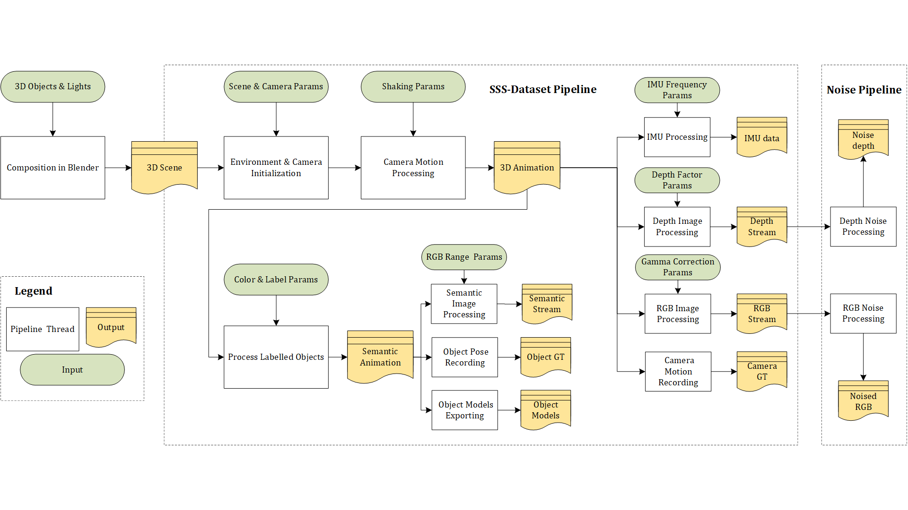

# SSS-dataset
This is a repo for toolset of SSS (ShanghaiTech Semantic SLAM) dataset, a realistic and accurate synthetic dataset generation in Blender for semantic visual SLAM and deep learning research.

**Authors:** [Cao Yuchen](https://github.com/CaoYuchen), [Laurent Kneip](https://github.com/laurentkneip), Hu Lan

## Installation
Tested on Mac, Windows, Ubuntu 16.04 & 18.04

**Recommended Prerequisites:**

- [Blender](https://www.blender.org/) >= 2.8

- Python 3.7.4

**Recommended Resources:**

- 3D Objects:

	- [TurboSquid](https://www.turbosquid.com)

	- [Free3D](https://free3d.com/)

- Texture Materials:

	- [Poliigon](https://www.poliigon.com/)

	- [CC0 Textures](https://cc0textures.com/)

> Note: The recommended public resources are useful and handy If you want to build your own scene in Blender. This repo doesn't include the tutorial of establishing blender scenes.

## Usage

This toolset supports the generation of RGB-D, Stereo RGB, RGB-IMU dataset, with ground truth of camera trajectories, object 3D models, object poses, semantic segmentation maps and system parameters. 

We provide an example of [SSS-room4](http://mpl.sist.shanghaitech.edu.cn/SSSBenchmark/dataset/blender/room4.blend) (click to download .blend file) with everything set up already. You can swith workspace to `Scripting` in Blender and click `Run Script` with no need to learn Blender. Or you can open `Python Console` in Blender and run examples such as:

```bpy.data.texts["SSSparameters.py"].as_module()```

Main files that require setting up parameters are:

- [SSSparameters.py](https://github.com/CaoYuchen/SSS-dataset/blob/master/Blender_python/SSSparameters.py): Initialization of render settings, you can customize camera settings such as FPS, FOV, stereo baseline, the duration of streams, etc. 

- [segMap.py](https://github.com/CaoYuchen/SSS-dataset/blob/master/Blender_python/segMap.py): Label objects with semantic color, you can customize which objects as semantic instance and be labelled with which color.

- [imu.py](https://github.com/CaoYuchen/SSS-dataset/blob/master/Blender_python/imu.py): Customize the frequency of IMU data recording.

If you want to change the scene, you can modify the scene and customize the dataset based on our examples, make sure new changes compromise with below rules:

- New trajectories: modify Bezier curve named `animatePath` to customize camera trajectory

- New objects: name correctly according to their semantic label. e.g. chairs with same class should be named as `chair1`, `chair1.001`, `chair.002`, etc. You can also change the code instead if you insist in your terminology.

- New textures: textures should be directly linked to objects, avoid linking texture with the child of target objects. To manage this, simply choose parent and children and press `ctrl + J`. 

> Note: For unification of exported 3D models and pose of objects, we define the origin point of object at its bottom center, i.e. geometry center with z=0, y points forward. Make sure imported new objects' origin points are correctly defined. 

For more indoor scenatio examples and related dataset download, please visit our website [http://mpl.sist.shanghaitech.edu.cn/SSSBenchmark/SSS@MPL.html/](http://mpl.sist.shanghaitech.edu.cn/SSSBenchmark/SSS@MPL.html/) for more details.

## Pipeline



## FAQ
If you have problems running the pipeline and/or issues with code, you might find useful information or welcome to leave issues in the issue tracker.

## MIT License
SSS-dataset is open source under the MIT license, see the [LICENSE](https://github.com/CaoYuchen/SSS-dataset/blob/master/LICENSE) file.